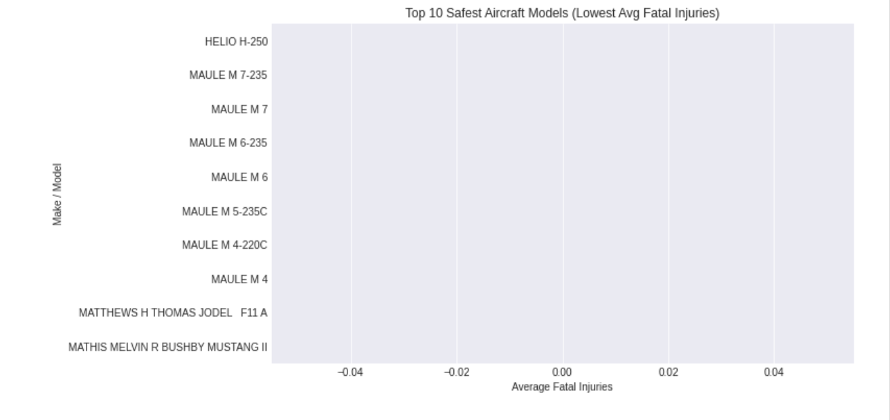
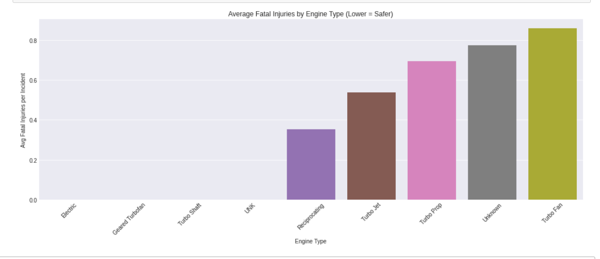
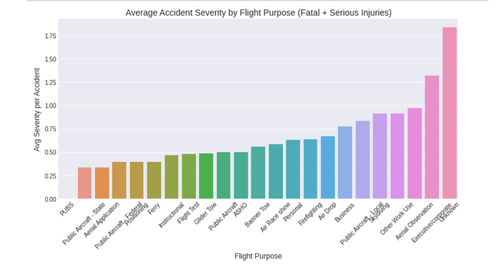

# Aircraft Recommendation For Company X
AUTHOR: [Lilibeth Chepngetich Langat](mailto:beth13lilib@gmail.com)

# Overview
This project gives recommendations for a certain company X that is interested in purchasing and operating airplanes for commercial and private enterprises. Analysis of aviation accident data from the the National Transportation Safety Board shows the number of accidents that have happened over the years and the factors surrounding those incidents. The head of the new aviation division can use these findings to help them decide which aircraft to purchase.

# Business Understanding
The company is expanding into new industries to diversify their portfolio specifically the aircraft business. There are a number of risks associated with aircrafts including safety and financial risks and the company leadership currently lacks the expertise to evaluate which aircraft configurations offer the lowest exposure. The objective of this analysis is to identify aircraft models and engine configurations that demonstrate the lowest accident severity and damage outcomes, allowing executives to make confident decisions grounded in real-world data. 

# Data Understanding
The dataset [dataset](https://www.kaggle.com/datasets/yassereleraky/aviation-accident-ntsb) consists of past aircraft accident reports, including key attributes such as aircraft make and model, engine type, number of engines, injury outcomes, and aircraft damage classifications. Numerical fields such as fatal and serious injuries are essential indicators of crash severity, while categorical attributes like engine configuration and aircraft damage provide insight into operational and financial risk. Some fields contain missing or inconsistent data, which are handled selectively dropping records where critical severity metrics are absent, while imputing or grouping less critical missing data where reasonable. Overall, the dataset provides a reliable foundation for identifying low-risk aviation configurations suitable for fleet acquisition.

# Methods

The dataset was cleaned by handling missing values through a mix of imputation and removal, depending on the impact on accuracy. Key variables such as injury counts, engine type, and flight purpose were standardized for consistency. The data was then grouped, aggregated, and analyzed to compare aircraft models, engine configurations, and flight operations based on accident severity. Visualizations were created using Seaborn and Matplotlib to identify low-risk aircraft options and support data-driven recommendations.

# Results
The visualizations showed clear differences in safety performance across aircraft types. Certain models consistently recorded zero or near-zero fatal injuries, making them strong candidates for acquisition. Engine analysis revealed that  engines like Electric and Geared turbofan types tend to have fewer severe accidents. The barchart comparing flight purposes indicated that some operations experience more severe outcomes than others, suggesting the need for different safety policies depending on use case.

### Make/Model Recommendation based on Average Fatalities

### Safest Engine Type Recommendation based on Average Fatalities

### Risk Assessment by Flight Purpose (Commercial vs Private Operations)

# Conclusions & Next Steps

From the data, a few clear patterns stood out:

**1. Some aircraft models are much safer than others.**  
Models with very low or zero fatal accidents should be the top choices for purchase.

**2. Engine setup matters.**  
Aircraft with engines like Electric and Geared turbofan types tend to have fewer severe accidents.

**3. Accident severity changes depending on flight purpose.**  
Commercial, private, and training flights don’t all carry the same level of risk. Some flight types may require stricter rules or better equipment.

## What to Do Next

**Create a shortlist of the safest aircraft models and engine types.**  
These should be reviewed further for pricing, availability, and maintenance costs.

**Set different safety procedures depending on the type of operation.**  
For example, commercial flights may need more experienced pilots or better-equipped aircraft.

**Check how accident trends have changed over the years for top models**  
If a model keeps improving, it's a strong long-term choice.

These findings give Company X a clear starting point for choosing aircraft that are both safe and practical to operate.

## For more Information
See the full analysis in the [Jupyter notebook](main.ipynb) or review this presentation 
For more information contact me at  [Lilibeth Chepngetich Langat](mailto:beth13lilib@gmail.com)

# Repository Structure

├── data
├── images
├── README.md
├── Animal_Shelter_Needs_Presentation.pdf
└── animal_shelter_needs_analysis.ipynb

