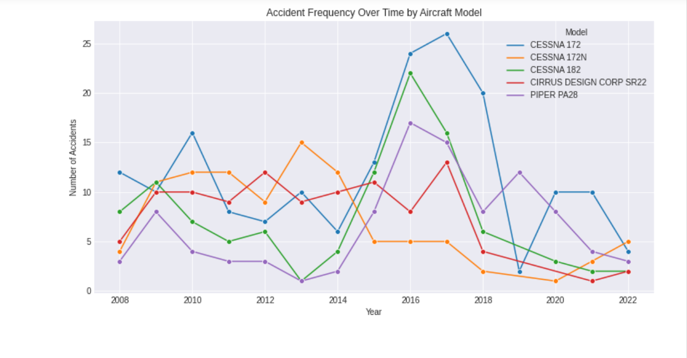
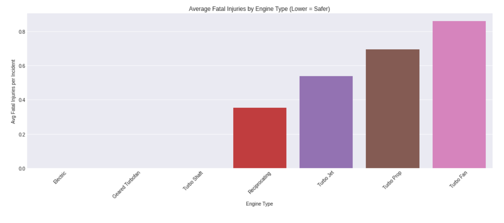
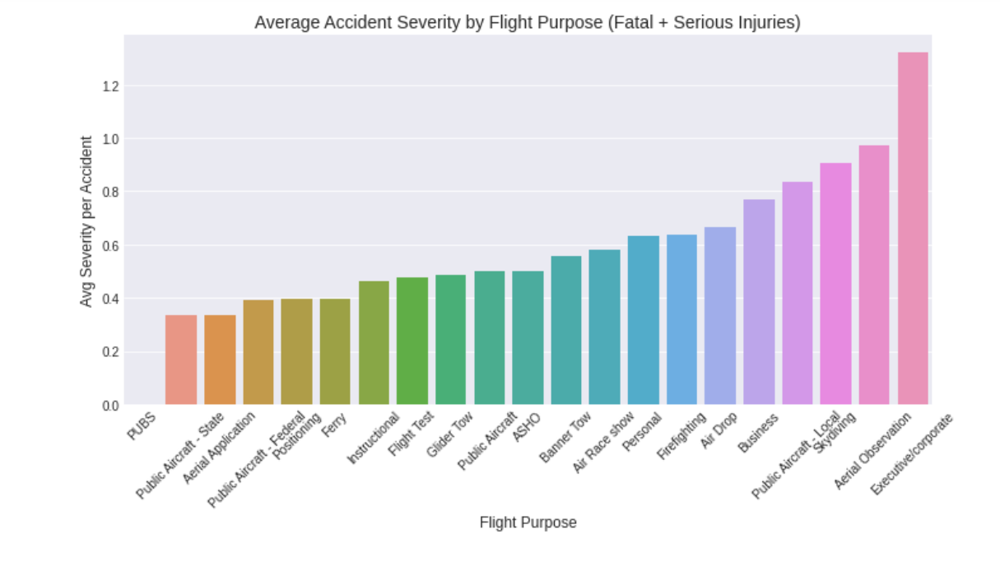

# Aircraft Recommendation For Company X

AUTHOR:   [Lilibeth Chepngetich Langat](mailto:beth13lilib@gmail.com)

# Overview
This project gives recommendations for a certain company X that is interested in purchasing and operating airplanes for commercial and private enterprises. Analysis of aviation accident data from the the National Transportation Safety Board shows the number of accidents that have happened over the years and the factors surrounding those incidents. The head of the new aviation division can use these findings to help them decide which aircraft to purchase.

# Business Understanding
The company is expanding into new industries to diversify their portfolio specifically the aircraft business. There are a number of risks associated with aircrafts including safety and financial risks and the company leadership currently lacks the expertise to evaluate which aircraft configurations offer the lowest exposure. The objective of this analysis is to identify aircraft models and engine configurations that demonstrate the lowest accident severity and damage outcomes, allowing executives to make confident decisions grounded in real-world data. 

# Data Understanding
The dataset [dataset](https://www.kaggle.com/datasets/yassereleraky/aviation-accident-ntsb) consists of past aircraft accident reports, including key attributes such as aircraft make and model, engine type, number of engines, injury outcomes, and aircraft damage classifications. Numerical fields such as fatal and serious injuries are essential indicators of crash severity, while categorical attributes like engine configuration and aircraft damage provide insight into operational and financial risk. Some fields contain missing or inconsistent data, which are handled selectively dropping records where critical severity metrics are absent, while imputing or grouping less critical missing data where reasonable. Overall, the dataset provides a reliable foundation for identifying low-risk aviation configurations suitable for fleet acquisition.

# Methods

The dataset was cleaned by handling missing values through a mix of imputation and removal, depending on the impact on accuracy. Key variables such as injury counts, engine type, and flight purpose were standardized for consistency. The data was then grouped, aggregated, and analyzed to compare aircraft models, engine configurations, and flight operations based on accident severity. Visualizations were created using Seaborn and Matplotlib to identify low-risk aircraft options and support data-driven recommendations.

# Results
The visualizations showed clear differences in safety performance across aircraft types. Certain models consistently recorded zero or near-zero fatal injuries, making them strong candidates for acquisition. Engine analysis revealed that  engines like Electric and Geared turbofan types tend to have fewer severe accidents. The barchart comparing flight purposes indicated that some operations experience more severe outcomes than others, suggesting the need for different safety policies depending on use case.

### Accident Trends by Aircraft Model Over Time



### Safest Engine Type Recommendation based on Average Fatalities



### Risk Assessment by Flight Purpose (Commercial vs Private Operations)



# Conclusions

- Turbofan and Turboprop engines show higher average fatality rates compared to Electric, Geared Turbofan, and Turbo shaft engines. This suggests that if safety is prioritized over performance or speed, the company should favor Reciprocating or emerging low-risk engine technologies.

- Flight purpose plays a major role in accident severity. Personal, Executive, and Local Skydiving operations show significantly higher injury rates, whereas activities like public service, aerial application, and ferry flights have lower severity. This means how the aircraft is used is just as important as which aircraft is chosen.

- Accident trends over time show improvement for some models and stagnation for others. Certain models like the Piper PA28, Cessna 182 and Cirrus Design Corp SR22 show declining accident frequency in recent years, signaling stronger reliability and better safety management practices.


# Next Steps for the Company

- Prioritize low-fatality engine configurations such as Geared Turbofan or Electric where operationally feasible. Avoid high-risk engine setups unless justified by mission requirements.

- Match aircraft purchases to low-severity flight purposes. If entering commercial or executive charter services, invest heavily in additional training and safety protocols, as these categories carry higher consequences when accidents occur.

- Shortlist aircraft models with proven declining accident trends. Use models like Cessna 182 or  as benchmark candidates for further cost-benefit analysis.

- Perform cost tradeoffs, cross-check insurance premiums, fuel efficiency, and maintenance costs for top safe models to determine which option balances safety and profitability.

- Investigate why certain flight purposes lead to higher risks.

## Tableau Dashboard

Feel free to interact with the visualization online on my [Aircraft Recommendation Tableau Dashboard](https://public.tableau.com/views/AIRCRAFTRECOMMENDATIONDASHBOARD/AIRCRAFTRECOMMENDATIONDASHBOARD?:language=en-US&:sid=&:redirect=auth&:display_count=n&:origin=viz_share_link) 

## For more Information
See the full analysis in the [Jupyter notebook](Aircraft_recommendation.ipynb) or review this  [presentation](Aircraft _recommendation_presentation.pdf)

For more information contact me at  [Lilibeth Chepngetich Langat](mailto:beth13lilib@gmail.com)

# Repository Structure
```python
├── data
├── images
├── README.md
├── Aircraft_recommendation_presentation.pdf
└── Aircraft_recommendation.ipynb
```
